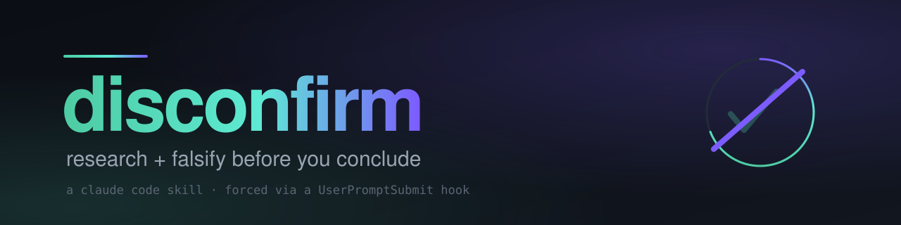
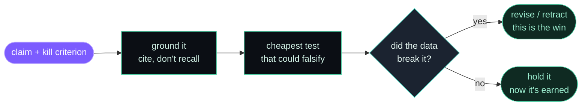

<p align="center">
  
</p>

<p align="center">
  <a href="LICENSE"></a>
  <a href="https://docs.claude.com/en/docs/claude-code"></a>
  <a href="hooks/disconfirm-nudge.py"></a>
  
</p>

<p align="center"><b>Make Claude try to break its own conclusion before it hands you one.</b></p>

---

## why this exists

I asked Claude to build a seven-session, verify-gated pipeline once. Spec goes to session one, a fresh session reviews it, approves or bounces it back, and so on down the line. We ended up with a real contraption: panels of judge models voting, a deterministic test floor under the votes, retry logic that evicts bad artifacts, an audit trail for every step.

Then I made it measure itself. Run a labeled set through the fancy machinery and through one sharp test, and compare. The machinery didn't win. Two moves did all the actual work:

1. Going and getting real evidence instead of reasoning from memory.
2. Running one cheap test built to prove the idea wrong — which disproved something I was sure about.

So I threw out the rest and kept those two. That's this skill. It's small on purpose. The whole lesson was that the elaborate apparatus was the part you could skip.

## what it actually does

Before Claude commits to a claim you're going to act on ("X is faster than Y", "the root cause is Z", "this is safe to ship"), it has to walk five steps:

1. State the claim in one line, and state the single thing you could observe that would prove it false. If nothing could prove it false, it isn't an empirical claim, and Claude has to stop dressing it up as one.
2. Go get evidence. Read the actual code, run the search, cite the source. Deliberately look for what contradicts the claim, not only what agrees with it.
3. Design the cheapest test that could kill it. A small labeled set, a five-run repeat to check it isn't luck, one adversarial probe, a held-out case. Write the pass/fail line down *before* running.
4. Run it, then report what the data said, especially when the data made Claude wrong. A disproved assumption is the success case.
5. Keep it right-sized. The minimum test that can falsify, not a fleet of agents. The ceremony was never the point.

## the loop



## install

One command, from the repo root:

```bash
./install.sh
```

It drops the skill into `~/.claude/skills/`, the hook into `~/.claude/hooks/`, and prints the settings snippet. Nothing gets overwritten without you doing it yourself.

If you'd rather do it by hand:

```bash
# the skill
cp -r skills/disconfirm ~/.claude/skills/

# the hook that makes Claude reach for it on its own (optional)
cp hooks/disconfirm-nudge.py ~/.claude/hooks/
chmod +x ~/.claude/hooks/disconfirm-nudge.py
```

Then wire the hook in `~/.claude/settings.json` (full example in [`hooks/settings.example.json`](hooks/settings.example.json)):

```json
{
  "hooks": {
    "UserPromptSubmit": [
      { "hooks": [ { "type": "command", "command": "python3 ~/.claude/hooks/disconfirm-nudge.py" } ] }
    ]
  }
}
```

The hook reads your prompt, and if it smells like a comparison, a benchmark, or an "is this right?" question, it injects a reminder telling Claude to run the discipline before answering. It fails open: any error and it prints nothing and exits 0, so it can never block a prompt. Skip it entirely if you'd rather call the skill by hand.

## a real example

The first thing I did with this skill was point it at itself. I asked Claude to confirm that I created it.

The easy answer is "yes, you did." Instead it went and read the session transcripts, found the exact message where I commissioned the skill, found the `Write` call that produced the file three minutes later, and came back with something more honest: yes, it's mine in conception and command, but the file was typed by Claude, on my order. Then it corrected its own framing once more when that came out too pedantic.

That back-and-forth is the entire point. It didn't tell me what I wanted to hear. It told me what the evidence said.

## when to reach for it

- "X is better / faster / safer / cheaper than Y", "we should use Z", "the best approach is..."
- A benchmark or comparison whose result decides something.
- "The root cause is...", "this fix works", "this is injection-safe" — before you ship.
- Any moment you notice you're confident and you haven't yet tried to break the belief.

## when not to

- A fact you can just look up. Look it up. That's research, not calibration.
- A trivial, easily-reversible choice where being wrong costs nothing.
- Pure execution with no contested claim in it.

## part of my arsenal

This is one of the skills I lean on daily working in Claude Code. More of the set will follow as I clean them up for sharing. If `disconfirm` saves you from shipping one confident-but-wrong conclusion, it's paid for itself.

## license

MIT. Use it, fork it, bend it to your own workflow. See [LICENSE](LICENSE).
